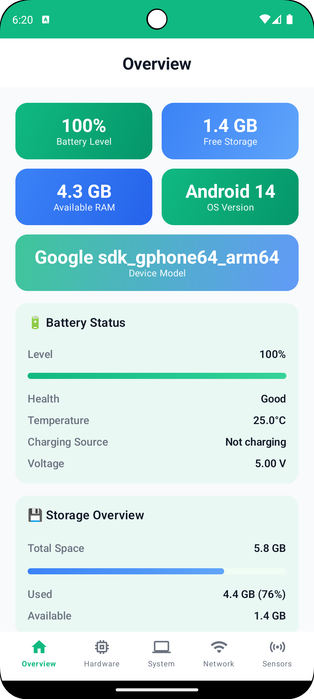
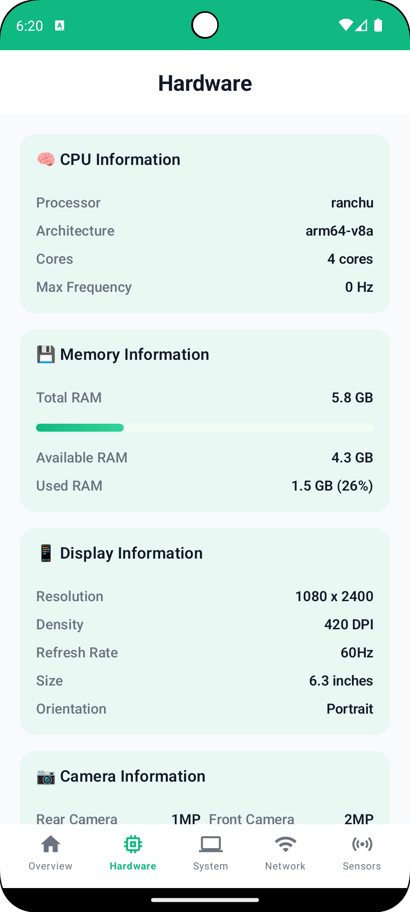
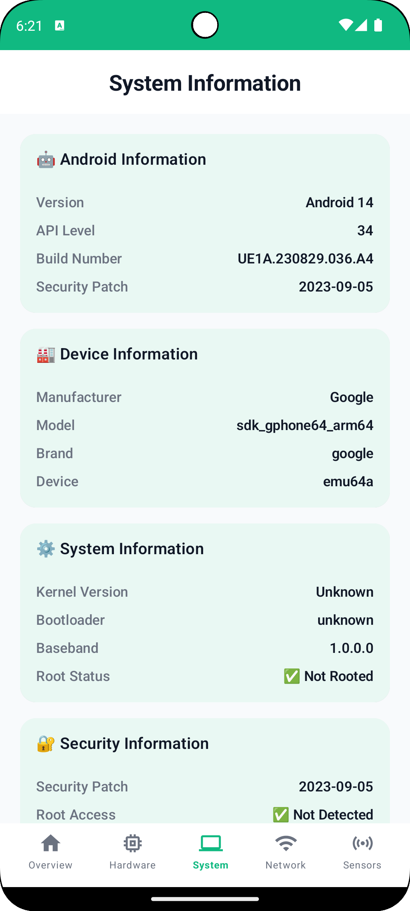
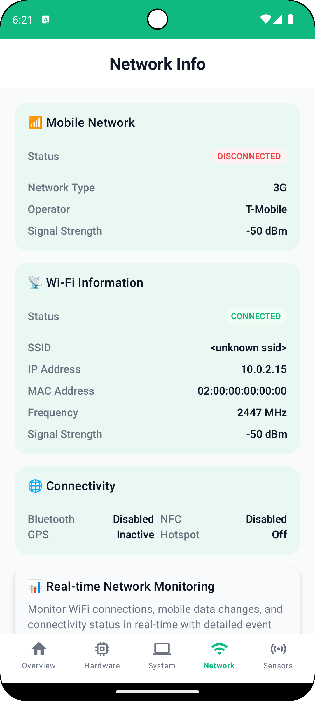
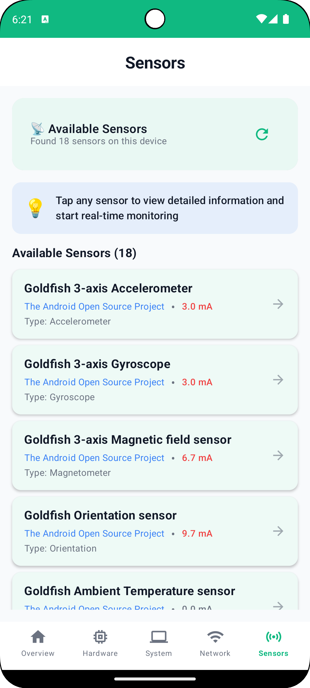
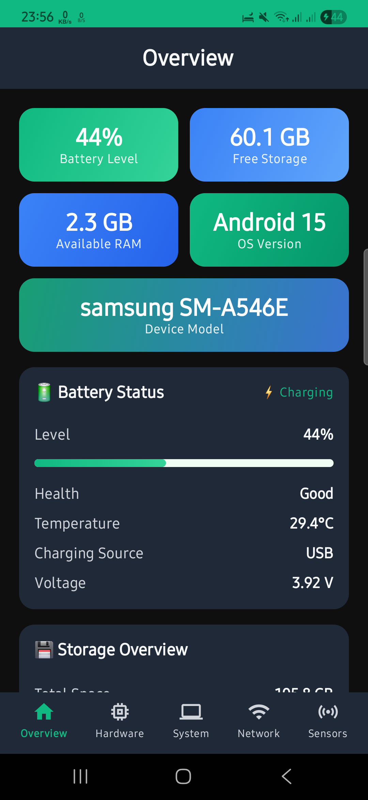
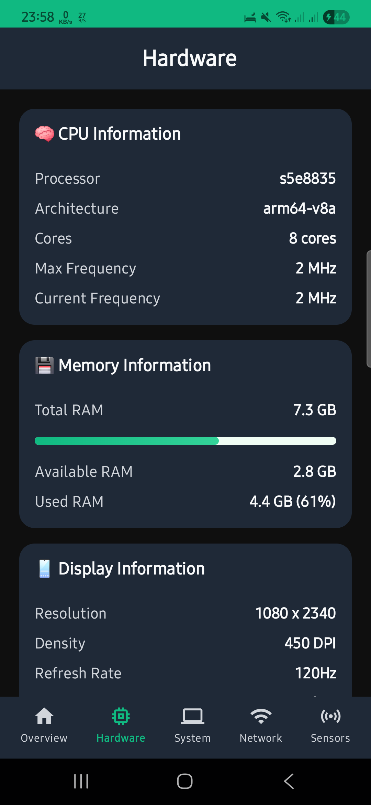
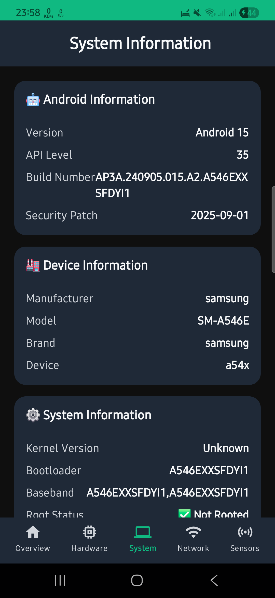
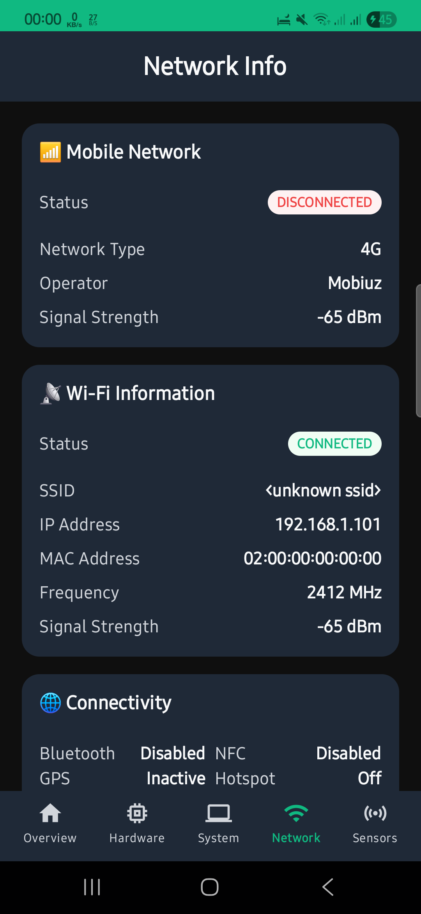
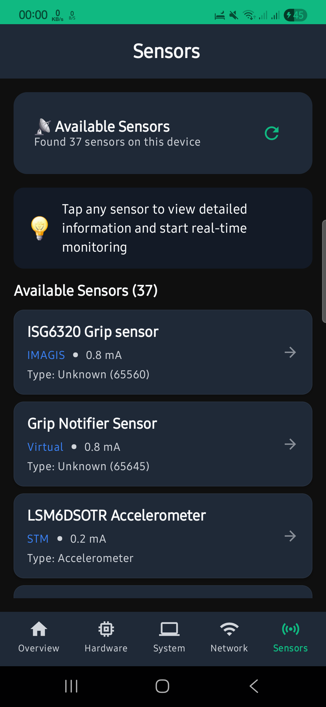

# CoreDroid - Device Information App

[](https://android-arsenal.com/api?level=27)
[](https://kotlinlang.org)
[](LICENSE)

A modern Android app built with Jetpack Compose that displays comprehensive device information including hardware specs, system details, network status, and real-time sensor data.

## Features

- **Device Overview** - Quick stats dashboard with battery, storage, RAM, and Android version
- **Battery Info** - Real-time monitoring of level, health, temperature, and charging status
- **Storage & Memory** - Detailed breakdown of internal/external storage and RAM usage
- **CPU & Performance** - Processor details, architecture, core count, and frequencies
- **Display Info** - Screen resolution, DPI, size, refresh rate, and HDR support
- **Camera Details** - Front/rear camera specs and hardware features
- **System Info** - Android version, security patch, manufacturer details, and kernel info
- **Network Status** - Wi-Fi/mobile network details with real-time connectivity monitoring
- **Sensor Monitoring** - Real-time data from all available device sensors

## Screenshots

<div align="center">

### Feature Graphic


### App Screens

| Overview | Hardware | System |
|:--------:|:--------:|:------:|
|  |  |  |

| Network | Sensors |
|:-------:|:-------:|
|  |  |

### Additional Screenshots

| Overview 2 | Hardware 2 | System 2 |
|:----------:|:----------:|:--------:|
|  |  |  |

| Network 2 | Sensors 2 |
|:---------:|:---------:|
|  |  |

</div>

## Tech Stack

- **Kotlin 2.0.21** - Modern programming language
- **Jetpack Compose** - Modern UI toolkit with Material 3
- **MVVM + MVI** - Clean architecture with unidirectional data flow
- **Coroutines & Flow** - Reactive programming and real-time monitoring
- **Koin** - Dependency injection
- **Navigation Compose** - Type-safe navigation

## Architecture

The app follows **Clean Architecture** with **MVI + MVVM** pattern for unidirectional data flow:

```
┌──────────────────────────────────────┐
│      Presentation Layer (MVI)        │
│  • Compose UI (Material 3)           │
│  • ViewModels (State Management)     │
│  • Contract (State/Intent/Effect)    │
└──────────────┬───────────────────────┘
               │ Flow<State>
┌──────────────┴───────────────────────┐
│         Domain Layer                 │
│  • Use Cases (Business Logic)        │
│  • Repository Interfaces             │
│  • Domain Models                     │
└──────────────┬───────────────────────┘
               │ Flow<T>
┌──────────────┴───────────────────────┐
│          Data Layer                  │
│  • Repository Implementations        │
│  • Data Sources (Android APIs)       │
│  • Real-time System Data             │
└──────────────────────────────────────┘
```

## Project Structure

```
app/src/main/java/com/sultonuzdev/coredroid/
├── core/                    # Core utilities and DI
├── data/                    # Data layer (repositories, data sources)
├── domain/                  # Domain layer (models, use cases)
└── presentation/            # UI layer (screens, components)
```

## Permissions

Required:
- `ACCESS_NETWORK_STATE` - Network status monitoring
- `ACCESS_WIFI_STATE` - Wi-Fi information

Optional (gracefully handled if denied):
- `CAMERA` - Camera specifications
- `READ_PHONE_STATE` - Phone information


Follow [Kotlin coding conventions](https://kotlinlang.org/docs/coding-conventions.html) and maintain clean architecture principles.

## Contact

- **Email**: sultonuzdev@gmail.com
- **GitHub**: [@SultonUzDev](https://github.com/sultonuzdev)

## License

```
MIT License

Copyright (c) 2025 SultonUzDev

Permission is hereby granted, free of charge, to any person obtaining a copy
of this software and associated documentation files (the "Software"), to deal
in the Software without restriction, including without limitation the rights
to use, copy, modify, merge, publish, distribute, sublicense, and/or sell
copies of the Software, and to permit persons to whom the Software is
furnished to do so, subject to the following conditions:

The above copyright notice and this permission notice shall be included in all
copies or substantial portions of the Software.

THE SOFTWARE IS PROVIDED "AS IS", WITHOUT WARRANTY OF ANY KIND, EXPRESS OR
IMPLIED, INCLUDING BUT NOT LIMITED TO THE WARRANTIES OF MERCHANTABILITY,
FITNESS FOR A PARTICULAR PURPOSE AND NONINFRINGEMENT. IN NO EVENT SHALL THE
AUTHORS OR COPYRIGHT HOLDERS BE LIABLE FOR ANY CLAIM, DAMAGES OR OTHER
LIABILITY, WHETHER IN AN ACTION OF CONTRACT, TORT OR OTHERWISE, ARISING FROM,
OUT OF OR IN CONNECTION WITH THE SOFTWARE OR THE USE OR OTHER DEALINGS IN THE
SOFTWARE.
```

---

**Made with ❤️ by [SultonUzDev](https://github.com/sultonuzdev)**
